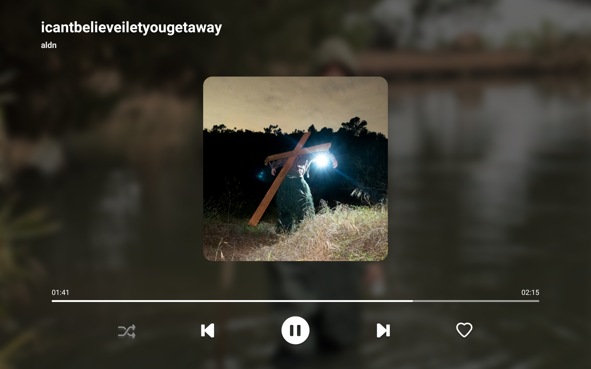
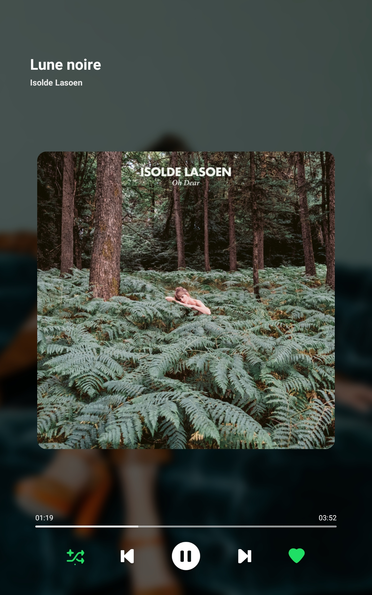

# Spotify Playback

**Spotify Playback** is an Android application that allows you to **display** and **control** the playback of your music from Spotify.
This project is personal and was done in my spare time to learn Android programming.

<p align="center">
    
</p>
<br/>
<p align="center">
    
</p>


## Description

The **Spotify Playback** Android application uses Spotify's API to display a player with information about the music currently playing.
The interface also features **controls** for controlling music playback *(play/pause, shuffle, like, etc.)*.
A **settings page** is available in the application, so you can customise it as you wish.

The application has been designed to function permanently as a **music screensaver**, displaying continuous music playback.
Controls, such as play and navigation buttons, are available but **remain secondary** to its main function.

You need a **Premium Spotify account** to use this application.

## Features

- Secure login with Spotify API *(OAuth 2.0)*
- Display of the current music being played
- Control of music playback *(play/pause, shuffle, like, next, etc.)*
- Settings page to customise the application
- Dark/Light mode
- FullScreen mode

## Installation 

Follow the instructions below to build and install the application on your device.

### Requirements

- [Android Studio](https://developer.android.com/studio)
- [Spotify Developer account](https://developer.spotify.com/)

### Build the project

#### 1. Clone the repository

```bash
git clone https://github.com/mathsrsl/Spotify-Playback.git
```

#### 2. Open the project in Android Studio
#### 3. Build the project :

* **Build the project directly in the device**
  - [Connect your device](https://developer.android.com/studio/run/device#connect) to your computer. **USB debugging** must be enabled on your device in the developer options. 
  You can also connect your device via **Wi-Fi** with wireless debugging *(see [documentation](https://developer.android.com/studio/run/device#wireless))*.
  - When your device is connected, click on the `Run` button at the top of Android Studio and wait for the application to be installed on your device.
  The application will start automatically on your device if the installation is successful.

* **Create an APK file** 
  - Click on the `Build` menu at the top of Android Studio
  - Then click on `Build Bundle(s) / APK(s)` and then on `Build APK(s)`. 
  - If the build is successful, you will find the APK file in the `app/build/outputs/apk/debug` folder of the project.

#### 4. Create a Spotify Developer app

#### 5. Install and run the application on your device

- When the application is installed on your device, you can open it and **log in with your Spotify account**.
- The application will show you a message if the spotify application is not installed on your device. You can install it from the [Play Store](https://play.google.com/store/apps/details?id=com.spotify.music).
- After entering your [Spotify credentials](#create-a-spotify-developer-app) *(client id)*, you will be redirected to the Spotify website/application to **authorise the application** to access your Spotify account.
- If spotify asks you to authorise the application, click on `Accept` to allow the application to access your Spotify account.

### Create a Spotify Developer app

1. Go to the [Spotify Developer Dashboard](https://developer.spotify.com/dashboard)
2. Click on `Create an App`
3. Fill in the form with the following information: *(you can also copy the information from the home page of the application)*
   - **App Name:** Whatever you want
   - **Description:** Whatever you want
   - **Redirect URIs:** `com.example.spotifyplayback://callback`
   - **Android Package Name:** `com.example.spotifyplayback`
   - **APIs used:** Android

   <br/>

   > For the **Android Package Name**, you need a SHA-1 fingerprint. You can get it by running the following command in the terminal:
   > 
   > *(only for debug keystore, for release keystore, you need to generate a new keystore, see [below](#building-a-release-version))*
   > 
   > - Windows: 
   > ```bash
   > keytool -list -v -keystore "%USERPROFILE%\.android\debug.keystore" -alias androiddebugkey -storepass android -keypass android
   > ```
   > - Linux/MacOS:
   > ```bash
   > keytool -list -v -keystore ~/.android/debug.keystore -alias androiddebugkey -storepass android -keypass android
   > ```
   > 
   > *(The default password is `android`, if you have changed it, replace `android` with **your password**)*


## Building a Release Version

*(Optional)*

To build a **release version** of this application, you'll need to provide your own keystore file.
Complete the `keystore.properties` file at the root of the project with the following contents:

```properties
storeFile=/path/to/your/keystore.jks
storePassword=your_keystore_password
keyAlias=your_key_alias
keyPassword=your_key_password
```

Ensure that `keystore.properties` is **not included** in version control by adding it to your `.gitignore` file.

## Usage

Like said before, the application is designed to function permanently as a **music screensaver**, so especially for **tablets** or **dedicated devices**.

When the application is launched, you will see the current music being played and the controls to navigate through the music.
By default, the application is in **fullscreen mode** and the controls **will disappear after 10 seconds of inactivity**.

For changing the settings, you can click on the **settings icon** at the top right of the screen. You need to click on the screen to make the controls appear again.

In the settings page, you can change the **theme of the application**, the **fullscreen mode**, the **display of the controls** and **disable features**.
To **disconnect** from your Spotify account or **clear the cache**, go to the bottom of the settings page.

## License

**Spotify Playback** is licensed under the [GPLv3](https://www.gnu.org/licenses/gpl-3.0.html) license. See the `LICENSE` file for more information.

## Author

Kayu - [kayuu.fr](https://kayuu.fr)

*August 2024*
